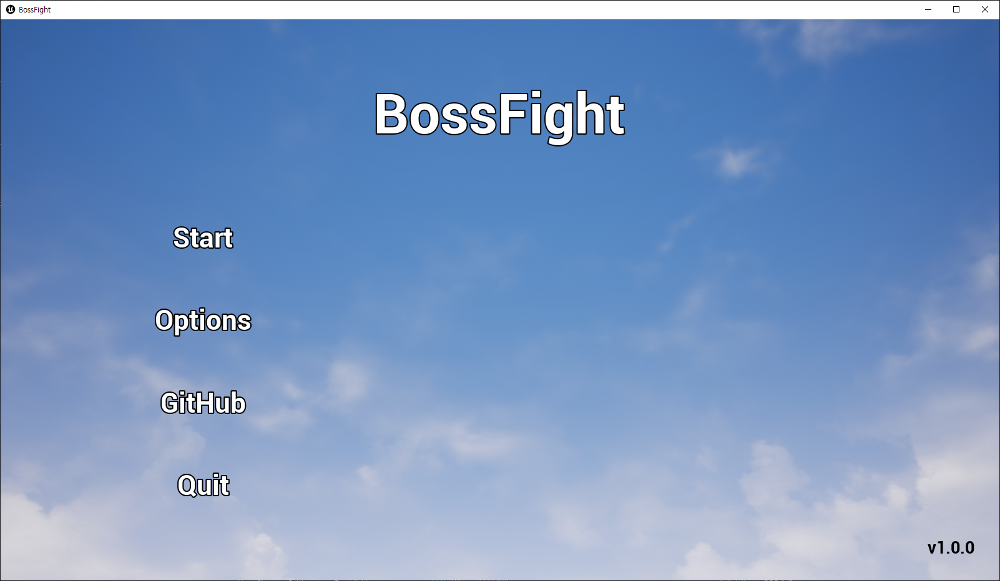
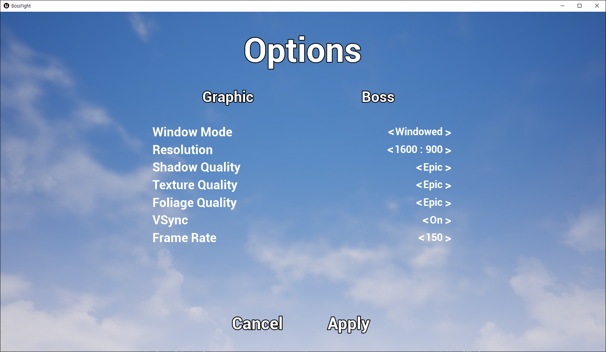
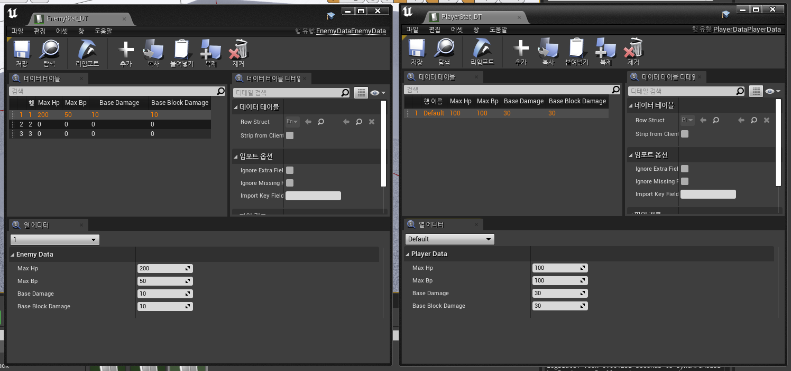
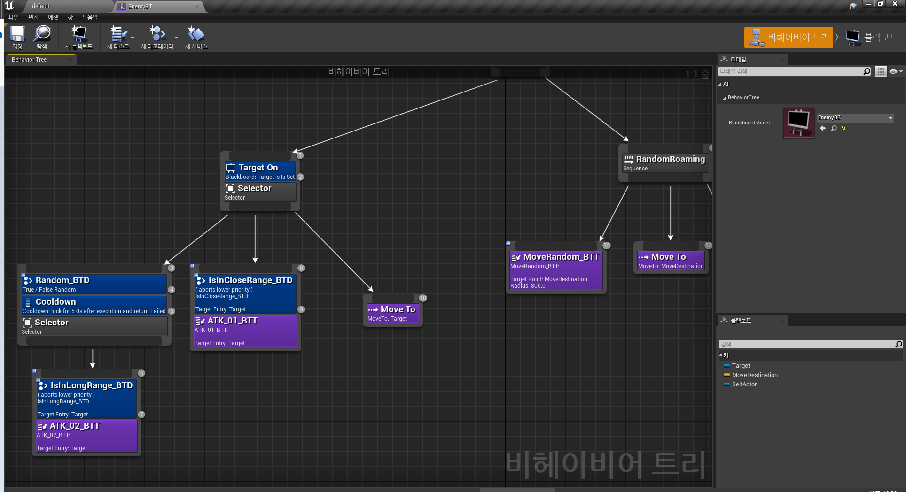

# BossFight
V1.0.0
Unreal Engine 4 used (C++ / Blueprint)

## [1] Title

Start : 게임을 시작합니다.
Options : 옵션을 선택합니다.
GitHub : 깃허브로 이동합니다
Quit : 게임을 종료합니다

## [2] Options

해상도, 화면 비율, 그림자, 텍스처 등을 설정합니다

## [3] Data Table

보스와 플레이어에 관한 데이터는 따로 데이터 테이블을 통해 관리합니다

## [4] Behavior Tree

보스의 인공지능은 BT를 통해 구현했습니다.

